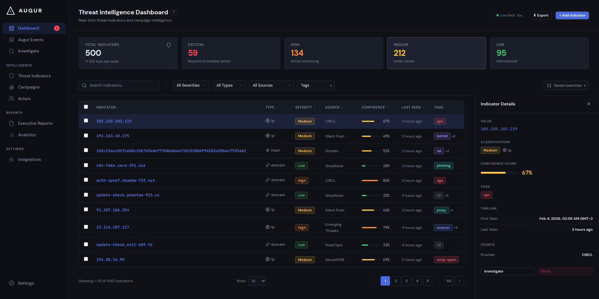
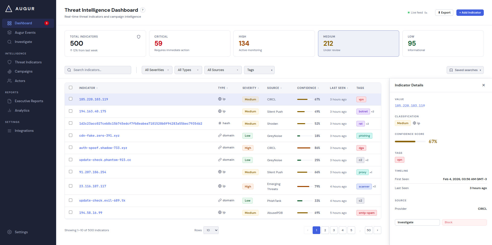
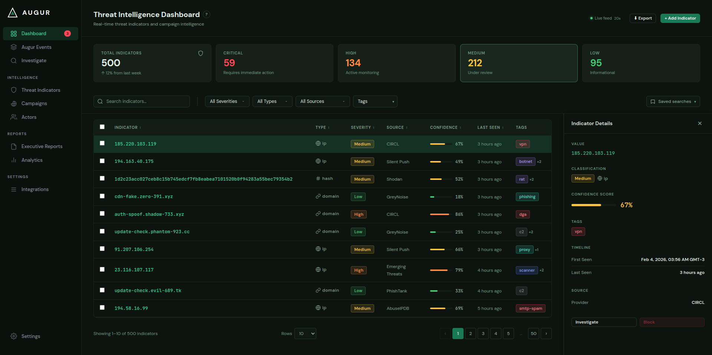
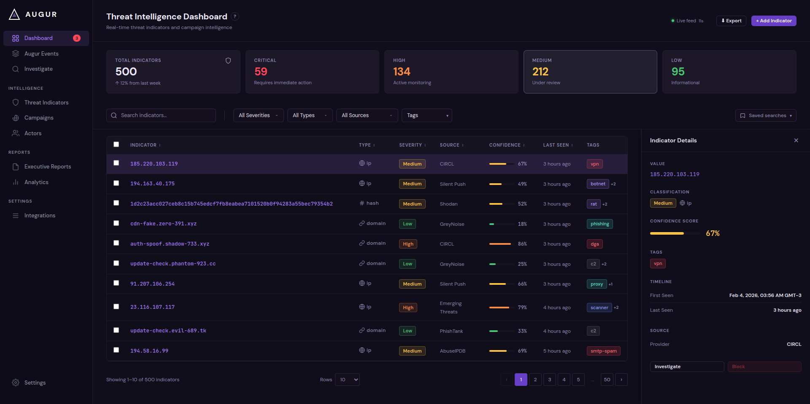
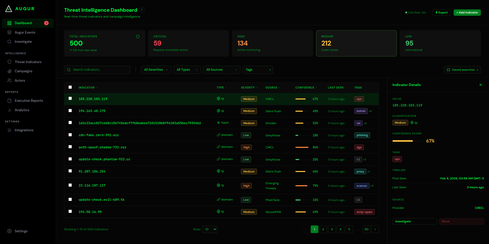

# Augur — Threat Intelligence Dashboard

A responsive React + TypeScript threat intelligence dashboard built as a front-end take-home assignment. Displays, filters, and explores security indicators against a live mock API.

**[View live →](http://intellidashboard.fardus.dev/)**

---

## Screenshots

<table>
<tr>
<td align="center" width="50%"><b>Midnight</b><br/></td>
<td align="center" width="50%"><b>Light</b><br/></td>
</tr>
</table>

<table>
<tr>
<td align="center" width="33%"><b>Forest</b><br/></td>
<td align="center" width="33%"><b>Dusk</b><br/></td>
<td align="center" width="34%"><b>Terminal</b><br/></td>
</tr>
</table>

---

## Features

**Core dashboard**

- Paginated indicator table with 8 columns and live `/api/indicators` data
- Stats row (total, critical, high, medium, low) from `/api/stats`
- Search with 300ms debounce + severity, type, and source filters
- Slide-in detail panel with first-seen → last-seen timeline

**Designed elements made functional**

- Column sort — client-side, animated ↑↓ carets in thead
- Multi-row checkbox select with sticky bulk actions bar
- Export CSV — current filtered and sorted results, client-side via `Blob`
- Add Indicator modal — controlled form, client-side validation, optimistic insert
- Auto-refresh — 30s interval with SVG arc countdown, new rows briefly highlighted

**Extra features**

- Stats overview modal — SVG donut chart, pure arcs via `stroke-dasharray`, no chart library
- Tag multi-select filter with removable chips
- Saved filter presets — name, save, and restore any filter combination
- Settings page — theme picker, language switcher, row density, expand tags toggle
- Rows per page selector — 10 / 20 / 50
- URL sync — active filters persisted to query string via `history.replaceState`
- Guided onboarding tour — step-by-step walkthrough of the UI on first visit
- Keyboard navigation + shortcuts modal — full keyboard control of the entire UI
- Fully responsive — sidebar collapses to a hamburger drawer on mobile, detail panel goes full-screen, stat cards reflow to a 2-column grid, toolbar stacks vertically on small viewports

**Keyboard shortcuts**

- `/` — focus search
- `↑ / ↓` — move between table rows
- `Enter` — open detail panel, `Esc` — close
- `Space` — toggle row checkbox
- `← / →` — previous / next page
- `?` — keyboard shortcuts reference modal

**Themes & i18n**

- 5 themes: Midnight, Light, Forest, Dusk, Terminal
- Full CSS custom property token system — 70+ tokens overridden per theme
- 3 languages: English, Spanish, Japanese

---

## Accessibility

WCAG 2.1 AA compliant across all five themes, verified with axe DevTools and WAVE.

| Page                   | AIM Score | Errors | Contrast errors |
| ---------------------- | --------- | ------ | --------------- |
| Dashboard (all themes) | 9.5 / 10  | 0      | 0               |
| Settings (all themes)  | 9.8 / 10  | 0      | 0               |

What was addressed:

- Per-theme severity color overrides so text passes 4.5:1 on all backgrounds including selected-row composites
- `--btn-primary-bg` token decouples button backgrounds from the accent color (which is intentionally bright for use as text on dark surfaces)
- `aria-sort` on `<th>`, not on child `<button>` — correct per ARIA spec
- Focus traps on all modals and the mobile drawer via `useFocusTrap`
- `role="switch"` toggles, `role="meter"` on confidence bars, `role="dialog" aria-modal` on all overlays
- Keyboard shortcuts surfaced via `?` button and modal
- `<nav aria-label="Pagination">`, `aria-current="page"`, `aria-label` on every icon-only control

---

## Live deployment

The live demo runs entirely on Cloudflare's edge — no origin server.

| Layer    | Service                                          |
| -------- | ------------------------------------------------ |
| Frontend | Cloudflare Pages — `intellidashboard.fardus.dev` |
| API      | Cloudflare Worker — `augur-api.fardus.dev`       |

The mock Express API (`server/`) was ported to a Worker (`worker/index.js`) that runs the same data-generation logic. Responses are cached at the edge for 12 hours per unique URL (including query string), so each distinct filter combination is computed at most twice a day regardless of traffic. Locally, Vite proxies `/api/*` to the Express server on port 3001 — the app itself is unaware of the difference.

---

## Architecture notes

**No runtime dependencies beyond React.** No component library, no chart library, no date library.

| Concern                   | Approach                                                                                                                                                                                                                                                                                      |
| ------------------------- | --------------------------------------------------------------------------------------------------------------------------------------------------------------------------------------------------------------------------------------------------------------------------------------------- |
| Styles                    | CSS Modules + SCSS — all tokens in `_tokens.scss` as `:root` custom properties, overridden per `[data-theme]`                                                                                                                                                                                 |
| Icons                     | Inline SVG — zero bundle cost, fully themeable via `currentColor`                                                                                                                                                                                                                             |
| Dates                     | `Intl.RelativeTimeFormat` — native browser API                                                                                                                                                                                                                                                |
| Race conditions           | `AbortController` per request — a new one is created on every filter change, cancelling any in-flight response                                                                                                                                                                                |
| Source filter             | Applied client-side post-fetch — the mock API doesn't accept a `source` param, so filtering is deferred rather than faked                                                                                                                                                                     |
| Mock data seed            | `generateIndicators` uses a fixed-seed PRNG instead of `Math.random()` — Cloudflare Workers can spin up multiple isolates that each regenerate the dataset, so without a seed the cached list and individual `/api/indicators/:id` lookups would disagree on IDs                             |
| Add Indicator persistence | New rows are inserted into view state only and lost on refresh. A real API endpoint would be overkill for a mock; localStorage would create an awkward hybrid where the app needs to GET from two sources and apply filters across both. View state is the honest choice for this constraint. |

---

## Running locally

```bash
npm install
npm run dev       # Vite dev server (5173) + mock API (3001) — proxied automatically
npm test          # Vitest unit tests
npm run build     # TypeScript check + production build
npm run lint      # ESLint, zero warnings enforced
```
